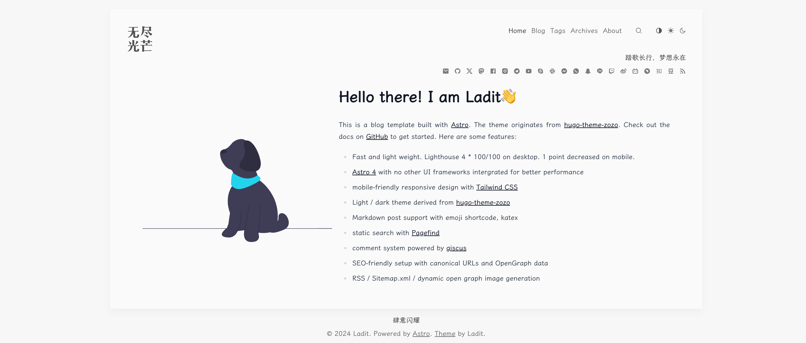
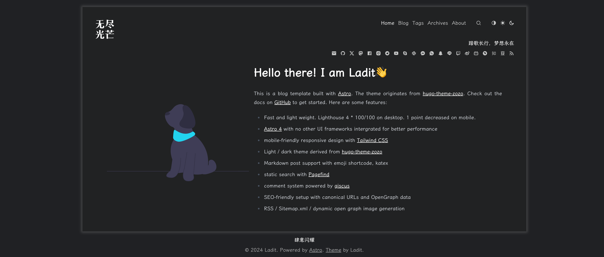

# [Astro](https://astro.build) 

An opinionated and neat blog template built with [Astro](https://astro.build). The theme originates from [hugo-theme-zozo](https://github.com/varkai/hugo-theme-zozo).

## Todo

- `@shikijs/transformers` require custom style
- i18n

## Contribute

Issues and PRs are welcome!

## License

[MIT / Creative Commons](./LICENSE)

## Acknowledgements

- [varkai/hugo-theme-zozo](https://github.com/varkai/hugo-theme-zozo)
- [Charca/astro-blog-template](https://github.com/Charca/astro-blog-template)
- [satnaing/astro-paper](https://github.com/satnaing/astro-paper)
- [ricora/alg.tus-ricora.com](https://github.com/ricora/alg.tus-ricora.com)
- [one-aalam/astro-ink](https://github.com/one-aalam/astro-ink)
